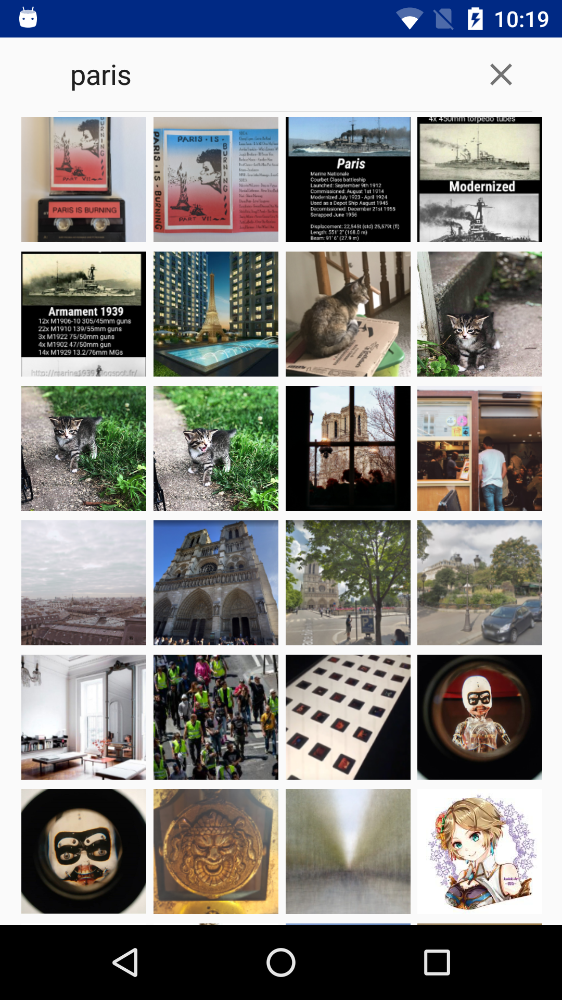
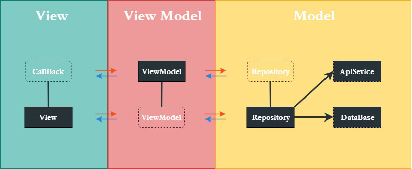
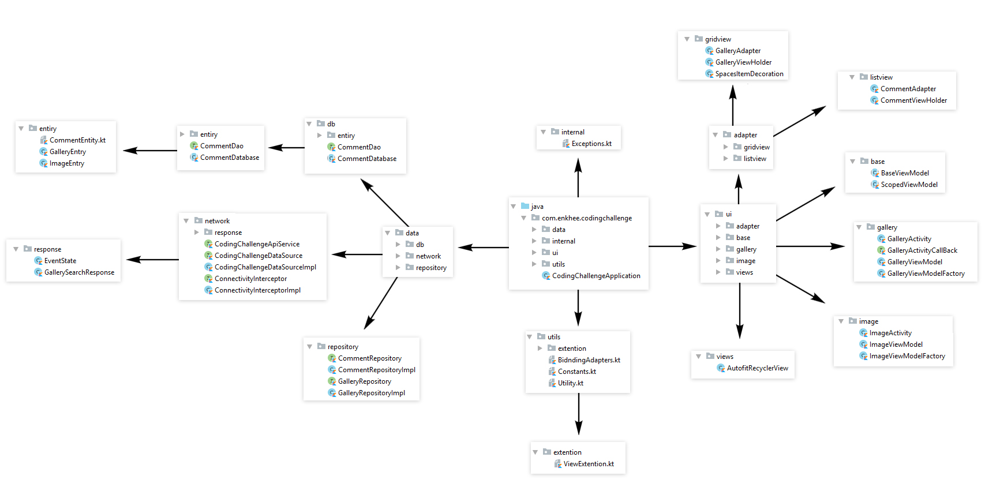

# Axxess-Coding-Challenge

This repository contains a detailed sample app that implements MVVM architecture using Android Architecture components (ViewModel, LiveData, DataBinding, Room Database), Kodien, RxJava, Retrofit, OkHttp3.

  
  
  

# Architecture Blueprint

  
   

  
# Architecture Blueprint

  
   

#### The app has following packages:
1. **data**: It contains all the data accessing and manipulating components.
3. **ui**: View classes along with their corresponding ViewModels.
4. **internal**: Extentions
5. **utils**: Utility classes.

### Library reference resources:
1. RxJava2: https://github.com/amitshekhariitbhu/RxJava2-Android-Samples
2. Kodein: https://github.com/Kodein-Framework/Kodein-DI
3. Retrofit: https://github.com/square/retrofit
4. OkHttp3 (Interceptor): https://github.com/square/okhttp
5. Coroutines: https://github.com/Kotlin/kotlinx.coroutines
6. Glide: https://github.com/bumptech/glide

### Concept reference resources:
1. [AutofitRecyclerView](http://www.devexchanges.info/2016/06/android-tip-auto-column-grid-layout-by.html)
